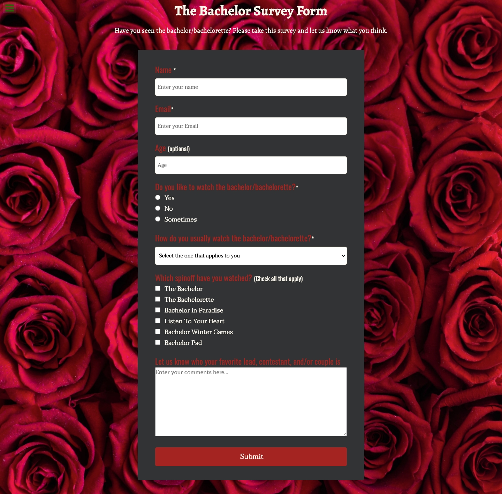
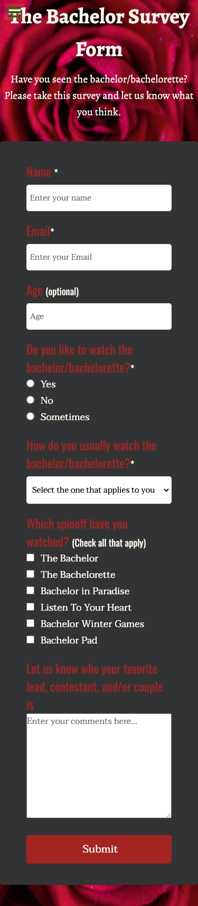

# FCC-Survey-Form

FreeCodeCamp Survey Form Project

This is my design to the [FreeCodeCamp Survey Form Project](https://www.freecodecamp.org/learn/responsive-web-design/responsive-web-design-projects/build-a-survey-form)

## Table of contents

- [Overview](#overview)
  - [Screenshots](#screenshots)
  - [Links](#links)
- [My process](#my-process)
  - [Built with](#built-with)
- [Author](#author)

## Overview

### Screenshots

### Links

- [Live Site URL](https://aoa19.github.io/FCC-Survey-Form/)

## My process

### Built with

- Semantic HTML5 markup

## Author

- Github: [@AOA19](https://github.com/AOA19)
